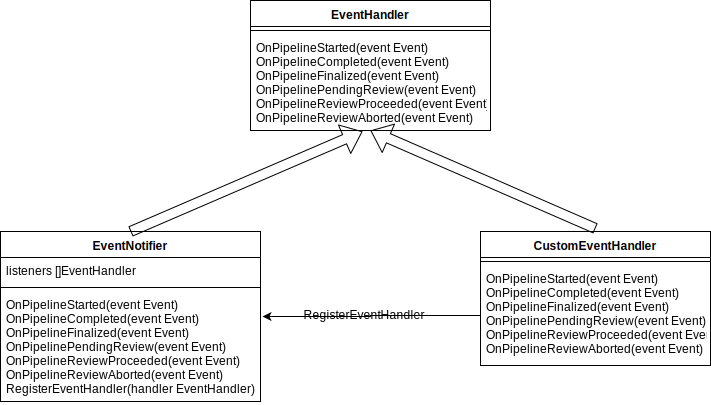

# DevOps Event

DevOps Event Event data generated by the KubeSphere DevOps engine.
This data enables KubeSphere to perform many useful functions. 
For example: 
1. Interfacing with KubeSphere notification system to push the status of the pipeline 
2. Push events to the front end via websock to avoid polling ...
Therefore we define the EventHandler interface so that users can easily implement their own specific EventHandler.


## General Event Type

KubeSphere is designed to interface with multiple types of DevOps engines, 
so KubeSphere uses a general event type instead of a specific DevOps engine event type.


The types of events currently available include the following:
```markdown
	PipelineStarted         = "pipeline.started"
	PipelineCompleted       = "pipeline.completed"
	PipelineFinalized       = "pipeline.finalized"
	PipelinePendingReview   = "pipeline.pendingReview"
	PipelineReviewProceeded = "pipeline.reviewProceeded"
	PipelineReviewAborted   = "pipeline.reviewAborted"
```

## Custom Event Handler

In KubeSphere, we define the `EventHandler` interface. 
If you want to implement specific Event logic, you should implement this interface,
and register custom `EventHandler` to `EventNotifier`。



EventNotifier is an intermediate component between Event producer and Event consumer. 
EventNotifier eliminates the need for CustomEventHandler to understand the source and type of Event (event will be converted to general event).

