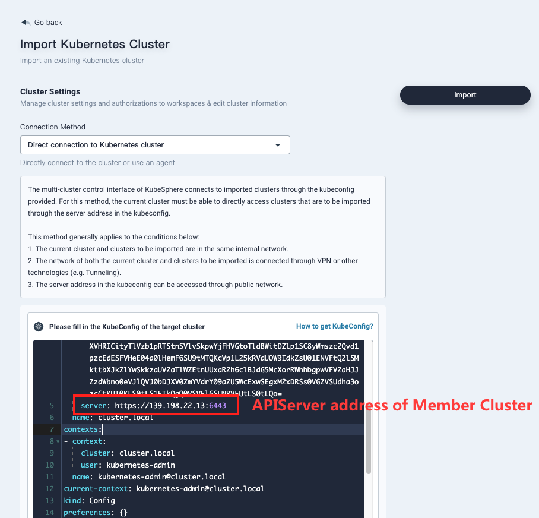
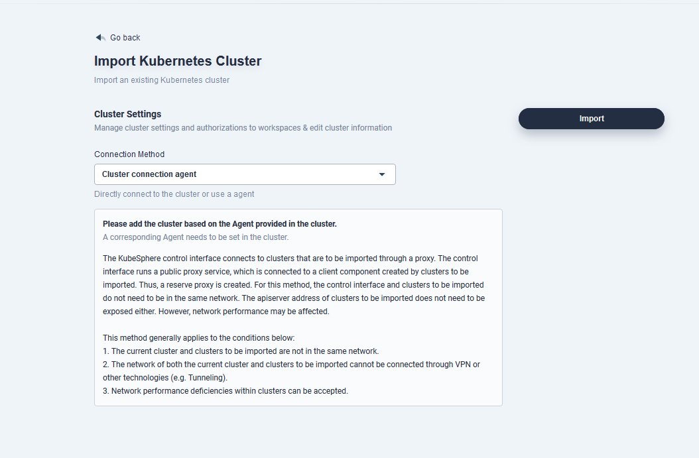

# How to Enable the Multi-cluster Feature

<!-- vscode-markdown-toc -->

* 1. [Overview](#Intro)
* 2. [Direct Connection](#direct)
  * 2.1. [Install Host Cluster](#HostCluster)
  * 2.2. [Install Member Cluster](#MemberCluster)
  * 2.3. [Import Cluster](#AddCluster)
* 3. [Agent Connection](#agent)
  * 3.1. [Install Host Cluster](#HostCluster-Agent)
  * 3.2. [Install Member Cluster](#MemberCluster-Agent)
  * 3.3. [Import Cluster](#AddCluster-Agent)

<!-- vscode-markdown-toc-config
	numbering=true
	autoSave=true
	/vscode-markdown-toc-config -->
<!-- /vscode-markdown-toc -->

## 1. <a name='Intro'></a>Overview

The multi-cluster feature relates to the network connection among multiple clusters. Therefore, it is important to understand the topological relations of clusters as the workload can be reduced.

Before you use the multi-cluster feature, you need to create a Host Cluster (H Cluster), which is actually a KubeSphere cluster that has enabled the multi-cluster feature. All the clusters managed by the H Cluster are called Member Cluster (M Cluster). They are common KubeSphere clusters that do not have the multi-cluster feature enabled. There can only be one H Cluster while multiple M Clusters can exist at the same time. In a multi-cluster architecture, the network between the H Cluster and the M Cluster can be connected directly or through an agent. The network between M Clusters can be set in a completely isolated environment.

## 2. <a name='direct'></a>Direct Connection

if the kube-apiserver address of M Cluster is accessible on any node of the H Cluster, you can adopt Direction Connection. This method is applicable when the kube-apiserver address of M Cluster can be exposed or H Cluster and M Cluster are in the same private network.

### 2.1. <a name='HostCluster'></a>Install Host Cluster

* There is no big difference between the installation of Host Cluster and the installation of KubeSphere. However, please note that in the config ClusterConfiguration of installer, the following item has to be set like following:

    ```yaml
    multicluster:
      clusterRole: host
    ```

  If you already have a standalone KubeSphere installed, you can change it to a host cluster by editing the cluster configuration and wait for a while.

    ```shell
    kubectl edit cc ks-installer -n kubesphere-system
    ```

### 2.2. <a name='MemberCluster'></a>Install Member Cluster

* In order for host cluster to manager member cluster, we need to make the jwtSecret same between them. So first get it from the host by the following command.

    ```bash
    $ kubectl -n kubesphere-system get cm kubesphere-config -o yaml | grep -v "apiVersion" | grep jwtSecret
      jwtSecret: "gfIwilcc0WjNGKJ5DLeksf2JKfcLgTZU"
    ```

* There is no difference between the installation of Member Cluster and the installation of common clusters that have their multi-cluster feature disabled. Please make sure "multicluster" is set as follows, input the corresponding jwtSecret shown above and wait for the installation to be completed.

    ```yaml
    authentication:
      jwtSecret: gfIwilcc0WjNGKJ5DLeksf2JKfcLgTZU

    multicluster:
      clusterRole: member
    ```

  If you already have a standalone KubeSphere installed, you can update the information by editing the cluster configuration and wait for a while.

    ```shell
    kubectl edit cc ks-installer -n kubesphere-system
    ```

### 2.3. <a name='AddCluster'></a>Import Cluster

* Open the H Cluster Dashboard and click Add Cluster. Enter the basic information of the cluster and click Next.

* In Connection Method, select `Direct Connection to Kubernetes cluster`. Copy the KubeConfig of the Member Cluster and paste it into the box. Please make sure the `server` address in KubeConfig is accessible on any node of the H Cluster. For `KubeSphere API Server` address, you can fill in the KubeSphere APIServer address or leave it blank.



* Click Import and wait for cluster initialization to finish.

## 3. <a name='agent'></a>Agent Connection

The component [Tower](https://github.com/kubesphere/tower) of KubeSphere is used for agent connection. Tower is a tool for network connection between clusters through the agent. If the H Cluster cannot access the M Cluster directly, you can expose the proxy service address of the H cluster. This enables the M Cluster to connect to the H cluster through the agent. This method is applicable when the M Cluster is in a private environment (e.g. IDC machine room) and it is possible to expose the proxy service of the H Cluster.

### 3.1. <a name='HostCluster-Agent'></a>Install Host Cluster

* There is no big difference between the installation of Host Cluster and the installation of KubeSphere. However, please note that in the config file of installer, the following item has to be enabled:

    ```yaml
    multicluster:
      clusterRole: host
    ```

  If you already have a standalone KubeSphere installed, you can change it to a host cluster by editing the cluster configuration and wait for a while.

    ```shell
    kubectl edit cc ks-installer -n kubesphere-system
    ```

* Set Proxy Service Address

  After the installation of the Host Cluster, a proxy service called tower will be created in `kubesphere-system`, whose type is LoadBalancer.

  1. If a LoadBalancer plugin is available for the cluster, you can see a corresponding address for `EXTERNAL-IP`, which will be acquired by KubeSphere automatically. That means we can skip the step to set the proxy. 

        ```shell
        $ kubectl -n kubesphere-system get svc
        NAME       TYPE            CLUSTER-IP      EXTERNAL-IP     PORT(S)              AGE
        tower      LoadBalancer    10.233.63.191   139.198.110.23  8080:30721/TCP       16h
        ```

  2. If you cannot see a corresponding address displayed, you need to manually set the proxy address. For example, you have an available public IP address 139.198.120.120. And the port 8080 of this IP address has been forwarded to the port 30721 of the cluster.

        ```shell
        $ kubectl -n kubesphere-system get svc
        NAME       TYPE            CLUSTER-IP      EXTERNAL-IP     PORT(S)              AGE
        tower      LoadBalancer    10.233.63.191   <pending>  8080:30721/TCP       16h
        ```

  3. Change the ClusterConfiguration of the ks-installer and input the the address you set before.

        ```shell
        $ kubectl -n kubesphere-system edit clusterconfiguration ks-installer

        multicluster:
            clusterRole: host
            proxyPublishAddress: http://139.198.120.120:8080 # Add this line to set the address to access tower
        ```

  4. Save the setting and restart ks-apiserver.

        ```shell
        kubectl -n kubesphere-system rollout restart deployment ks-apiserver
        ```

### 3.2. <a name='MemberCluster-Agent'></a>Install Member Cluster

* In order for host cluster to manager member cluster, we need to make the jwtSecret same between them. So first get it from the host by the following command.

    ```bash
    $ kubectl -n kubesphere-system get cm kubesphere-config -o yaml | grep -v "apiVersion" | grep jwtSecret
      jwtSecret: "gfIwilcc0WjNGKJ5DLeksf2JKfcLgTZU"
    ```

* There is no difference between the installation of Member Cluster and the installation of common clusters that have their multi-cluster feature disabled. Please make sure "multicluster" is set as follows, input the corresponding jwtSecret shown above and wait for the installation to be completed.

    ```yaml
    authentication:
      jwtSecret: gfIwilcc0WjNGKJ5DLeksf2JKfcLgTZU

    multicluster:
      clusterRole: member
    ```

  If you already have a standalone KubeSphere installed, you can update the information by editing the cluster configuration and wait for a while.

    ```shell
    kubectl edit cc ks-installer -n kubesphere-system
    ```

### 3.3. <a name='AddCluster-Agent'></a>Import Cluster

1. Open the H Cluster Dashboard and click Add Cluster. Enter the basic information of the cluster and click Next.

2. In Connection Method, select `Cluster connection agent` and Click Import. 

   

3. Create an `agent.yaml` file in the M Cluster based on the instruction and copy and paste the deployment to the file. Execute `kubectl create -f agent.yaml` on the node and wait for the agent to be up and running. Please make sure the proxy address is accessible to the M Cluster.

4. You can see the cluster you have imported in the H Cluster when the cluster agent is up and running.