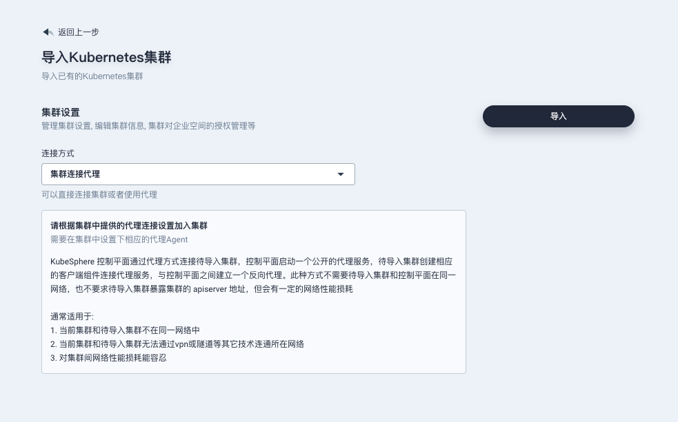
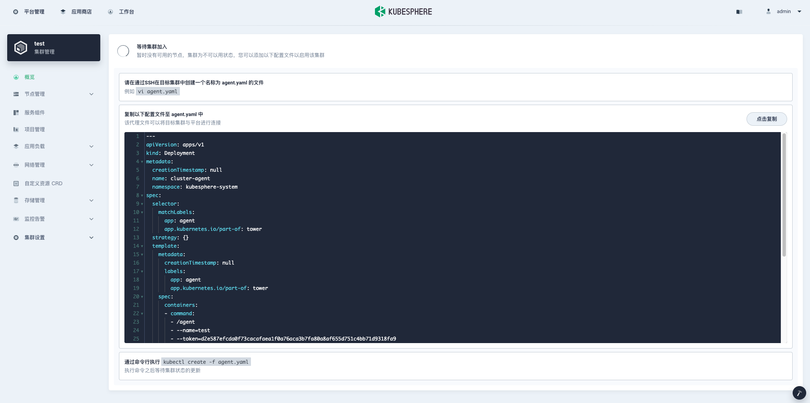

<!-- vscode-markdown-toc -->
* 1. [概述](#)
* 2. [直接连接](#-1)
	* 2.1. [安装 Host Cluster 集群](#HostCluster)
	* 2.2. [安装 Member Cluster 集群](#MemberCluster)
	* 2.3. [导入集群](#-1)
* 3. [代理连接](#-1)
	* 3.1. [安装 Host Cluster](#HostCluster-1)
	* 3.2. [安装 Member Cluster](#MemberCluster-1)
	* 3.3. [导入集群](#-1)

<!-- vscode-markdown-toc-config
	numbering=true
	autoSave=true
	/vscode-markdown-toc-config -->
<!-- /vscode-markdown-toc -->

# 如何启用多集群

##  1. <a name=''></a>概述
多集群功能涉及到多个集群之间的网络连通，了解之前集群之前的网络拓扑有助于减少接下来的工作量

多集群功能需要在创建一个Host Cluster，实际即是一个开启了多集群功能的KubeSphere集群，简称 H 集群。H 集群管理的所有集群称之为 Member Cluster， 即是一个普通的未开启多集群功能的 KubeSphere 集群，简称 M 集群。H 集群只能有一个， M 集群可以是多个。在多集群架构中，要求 H 集群和 M 集群网络可以连通， M 集群之间的网络不做要求，可以是处在完全隔离的环境中。

##  2. <a name='-1'></a>直接连接

如果 M 集群 kube-apiserver 地址可以在 H 集群上的任一节点上都能访问，即可以使用直接连接的方式。直接连接方式适用于 M 集群可以暴露 kube-apiserver 地址或者 H 和 M 集群处在同一个私网环境中。

###  2.1. <a name='HostCluster'></a>安装 Host Cluster 集群

安装 Host Cluster 与安装 KubeSphere 没有大的区别，唯一的区别在于安装时确保 installer 的配置文件中下列项是启用状态

    ```yaml
    multicluster:
    enabled: True
    ```

###  2.2. <a name='MemberCluster'></a>安装 Member Cluster 集群
- 安装 Member Cluster 和安装普通的未开启多集群功能的集群没有任何区别。确保安装时 installer 的 multicluster enabled 是 False 状态
    ```yaml
    multicluster:
        enabled: False
    ```
- 安装成功后，需要额外设置下集群的 `Token` 过期时间，以便 Host Cluster 可以纳管成员集群，使用 `kubectl -n kubesphere-system edit cm kubesphere-config` 修改集群配置 
    ```yaml
    apiVersion: v1
    data:
    kubesphere.yaml: |
        authentication:
        authenticateRateLimiterMaxTries: 5
        authenticationRateLimiterDuration: 30m0s
        maxAuthenticateRetries: 6
        multipleLogin: false
        jwtSecret: "Kub3sp83r3!"
        # 增加下面 oauth 配置
        oauthOptions:
            accessTokenMaxAge: 0
    ```
    保存后，需要执行 `kubectl -n kubesphere-system rollout restart deployment ks-apiserver` 重启 `ks-apiserver`
    行
- 准备工作完成

###  2.3. <a name='-1'></a>导入集群
- 打开 H 集群 dashboard，点击添加集群，输入集群基本信息后点击下一步。


- 连接方式选择 `直接连接KubeSphere集群`， 将 Member 集群的 kubeconfig 内容粘贴到输入框中。确保 kubeconfig 中的 `server` 地址在 H 集群中的任一节点都可以访问。`KubeSphere API Server` 地址填写 KubeSphere APIServer 的地址，可以不填。


- 点击导入，等待集群初始化完成即可

##  3. <a name='-1'></a>代理连接

代理连接使用到了 KubeSphere 的 [Tower](https://github.com/kubesphere/tower) 组件， Tower 是一个可以在集群间通过代理方式创建网络连接的工具。如果 M 集群不能直接被 H 集群访问到，可以通过暴露 H 集群代理服务地址，M 集群通过代理来创建和 H 集群的网络连接。代理连接的方式适用于 M 集群处在非公开的 IDC 机房、无公网 IP 地址的私有有环境，而 H 集群有能力暴露代理服务的场景。

###  3.1. <a name='HostCluster-1'></a>安装 Host Cluster  
- 安装 Host Cluster 与安装 KubeSphere 没有大的区别，唯一的区别在于安装时确保 installer 的配置文件中下列项是启用状态

    ```yaml
    multicluster:
    enabled: True
    ```
- 设置代理服务地址   
第一步安装完成后，`kubesphere-system` 项目下会创建一个名称为 tower ， type 为 LoadBalancer 的代理服务。
1. 如果集群有可以使用的 LoadBalancer 插件，可以看到 `EXTERNAL-IP` 栏目有对应的地址显示，KubeSphere会自动获取这个地址，我们可以跳过接下来的设置代理的步骤。
    ```shell
    root@master1:~# kubectl -n kubesphere-system get svc
    NAME       TYPE            CLUSTER-IP      EXTERNAL-IP     PORT(S)              AGE
    tower      LoadBalancer    10.233.63.191   139.198.110.23  8080:30721/TCP       16h
    ```
2. 如果一直没有对应的地址显示，则需要手动设置下代理地址。假设现在有可以对外的公网 IP 地址 139.198.120.120，已经通过端口转发的方式将此 IP 地址的 8080 端口转发到集群节点的30721端口。
    ```shell
    root@master1:~# kubectl -n kubesphere-system get svc
    NAME       TYPE            CLUSTER-IP      EXTERNAL-IP     PORT(S)              AGE
    tower      LoadBalancer    10.233.63.191   <pending>  8080:30721/TCP       16h
    ```
3. 修改配置文件，填入之前设置的地址
    ```shell
    root@master1:~# kubectl -n kubesphere-system edit cm kubesphere-config

    multicluster:
        enable: true
        agentImage: kubespheredev/tower:latest
        proxyPublishService: tower.kubesphere-system.svc
        proxyPublishAddress: http://139.198.120.120:8080 # 将设置的 139.198.120.120 
    ```
4. 保存设置，并且重启 ks-apiserver 
    ```shell
    root@master1:~# kubectl -n kubesphere-system rollout restart deployment ks-apiserver
    ```

###  3.2. <a name='MemberCluster-1'></a>安装 Member Cluster
- 安装 Member Cluster 和安装普通的未开启多集群功能的集群没有任何区别。确保安装时 installer 的 multicluster enabled 是 False 状态
    ```yaml
    multicluster:
      enabled: False
    ```
- 安装成功后，需要额外设置下集群的 `Token` 过期时间，以便 Host Cluster 可以纳管成员集群，使用 `kubectl -n kubesphere-system edit cm kubesphere-config` 修改集群配置 
    ```yaml
    apiVersion: v1
    data:
    kubesphere.yaml: |
        authentication:
        authenticateRateLimiterMaxTries: 5
        authenticationRateLimiterDuration: 30m0s
        maxAuthenticateRetries: 6
        multipleLogin: false
        jwtSecret: "Kub3sp83r3!"
        # 增加下面 oauth 配置
        oauthOptions:
            accessTokenMaxAge: 0
    ```
    保存后，需要执行 `kubectl -n kubesphere-system rollout restart deployment ks-apiserver` 重启 `ks-apiserver`
    行
- 准备工作完成

###  3.3. <a name='-1'></a>导入集群
1. 打开 H 集群 dashboard，点击添加集群，输入集群基本信息后点击下一步。

2. 连接方式选择 `集群连接代理`，点击导入



3. 根据提示在 M 集群中，创建一个 `agent.yaml` 文件，并将生成的部署粘贴到文件中，在节点上执行 `kubectl create -f agent.yaml`，等待 agent 运行正常。确保 M 集群上可以访问 H 集群的代理地址。



4. 集群代理运行正常后即可在 H 集群上看到导入的集群