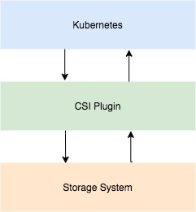

# CSI Plugin

## Overview

The Container Storage Interface (CSI) is a standard for exposing arbitrary block and file storage systems to containerized workloads on Container Orchestration Systems (COs) like Kubernetes.
Kubernetes 1.9 introduces an alpha implementation of CSI to integrate third-party storage system. By using CSI, third-party storage providers can write and deploy plugins to expose new storage systems in Kubernetes without ever having to touch the core Kubernetes code. With the development of Kubernetes, CSI plays more and more important roles on Kubernetes storage. Kubernetes would replace "in-tree" plugin with CSI.

## Cloud Providers CSI Plugins

### QingCloud IaaS Platform

For QingCloud IaaS, we have developed [QingCloud CSI](https://github.com/yunify/qingcloud-csi) plugin to enable users to use QingCloud IaaS storage resources since Kubernetes v1.10. People could use this plugin in many products, such as KubeSphere and QKE. Moreover, they can use this plugin in their own Kubernetes cluster based on QingCloud IaaS platform. Currently, this plugin has already implemented many features, such as volume management, snapshot management, topology awareness and volume monitoring.

### QingStor Storage System

We have developed [QingStor CSI](https://github.com/yunify/qingstor-csi) plugin to integrate Kubernetes with QingStor NeonSAN storage system. If users want to use Kubernetes on bare-metal, they may need to store data in QingStor storage system. The QingStor CSI plugin will also implement the latest CSI features.

### Other Storage System

Because KubeSphere is based on Kubernetes, KubeSphere can utilze various storage systems through their CSI plugin which supports [dynamic volume provisioning](https://kubernetes.io/docs/concepts/storage/dynamic-provisioning/). You can find CSI plugins in [Kubernetes CSI drivers list](https://kubernetes-csi.github.io/docs/drivers.html).